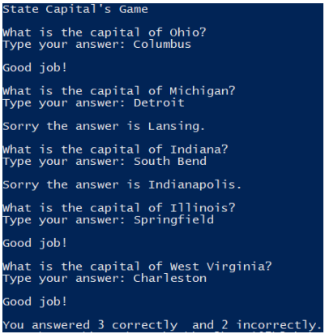

## State Capital Game

### Instructions:
 
- Create a Python game that quizzes the user on state capitals. The program should create a dictionary containing at least 5 states and their associated capital cities. The program should display the state name then prompt the user to enter the name of the capital city associated with the state. If the user gets the answer correct a congratulatory message should be displayed. If the user gets the answer incorrect the program should display the correct choice.  After all states have been presented the program should display the number of correct and incorrect answers given. 
- Enter your name, the lab number, and the current date into a set of comments at the top of the code.	
- Push the program source code to the assignment repo. 

### Example Output

### Grading:
2 – General, compiles, comments, proper indentation, etc  
2 - Dictionary Creation  
4 - Question Logic  
4 - Answer Logic  
2 - Summary Logic
